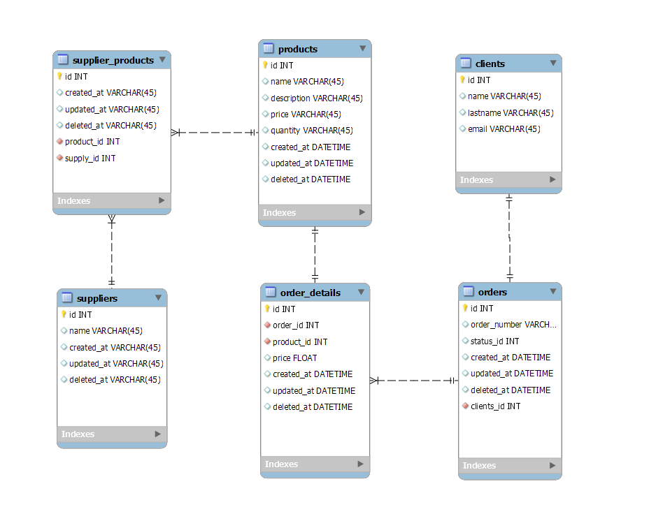

# Code Challenge

### Laravel API Rest VueJS SPA  [Dificultad: Baja]

#### CODE CHALLENGE

#### Instrucciones:

1. Crear colección de nodos API Rest del siguiente diagrama ER (Ver imagen).
2. Crear una aplicación SPA con VueJS que consuma y pueda interacturar con todos los métodos cruds de la API Rest. (Considerar las siguientes pantallas en la aplicación SPA: Registro, Iniciar sesión, Confirmación de correo electrónico, Restablecer contraseña)
3. Proteger las rutas con sanctum o con JWT y justificar la implementación seleccionada.
4. Elige algún motor de base de datos para almacenar los datos (Postgres, Mysql, MariaDB, MSSQL)de la API Rest y justifica la elección.
5. Versiona el código y cada uno de los pasos siguiendo la convención de Gitflow Workflow.
6. Documentar API Rest con Swagger.
7. Publicar API Rest y Aplicación SPA en alguna capa gratuita: Heroku, Elastic Beanstalk AWS, Render, Firebase, etc. y agregar url en readme del proyecto.

#### Nota:
Se evaluarán las prácticas en código, por lo tanto, tienes la oportunidad de ser seleccionado si demuestras habilidades
con pruebas unitarias, implementación de patrones de diseño para reutilizar código, dominio general del proceso de desarrollo e implementación.

Al finalizar compartir url del repositorio por whatsapp al siguiente contacto:
- Teléfono: 3325154811
- Email: mario@dropstudio.mx
